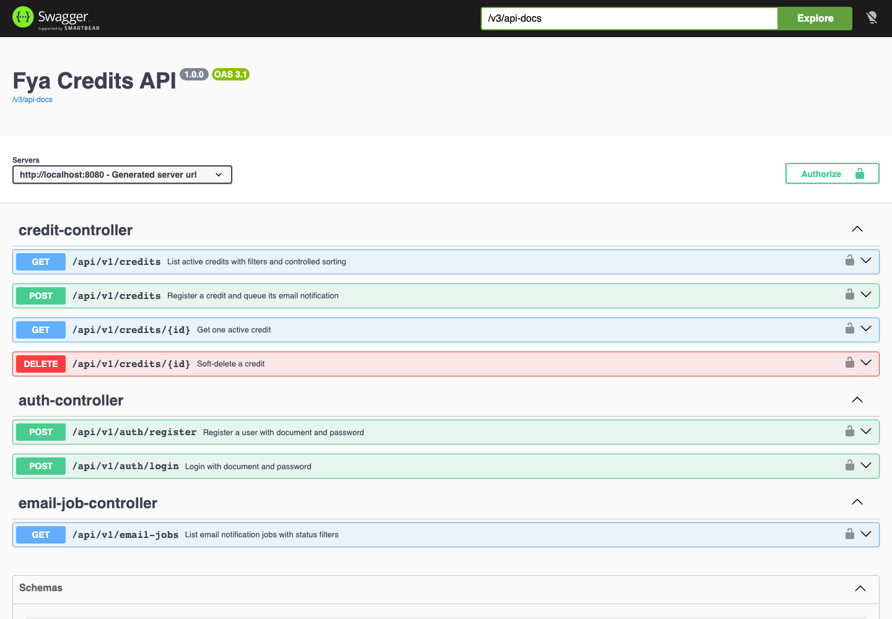
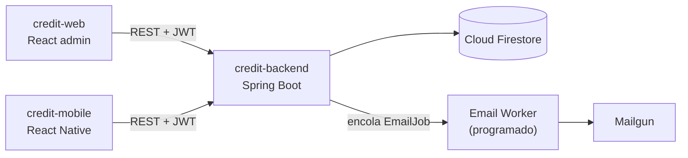
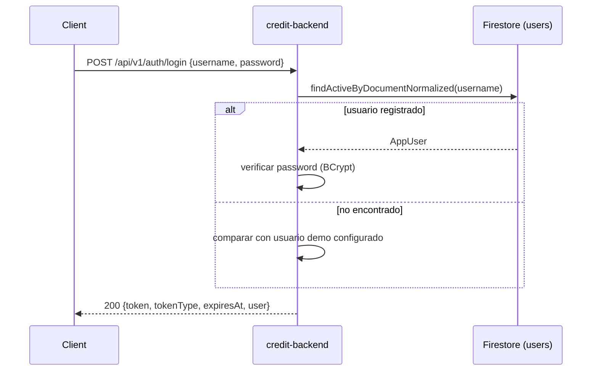
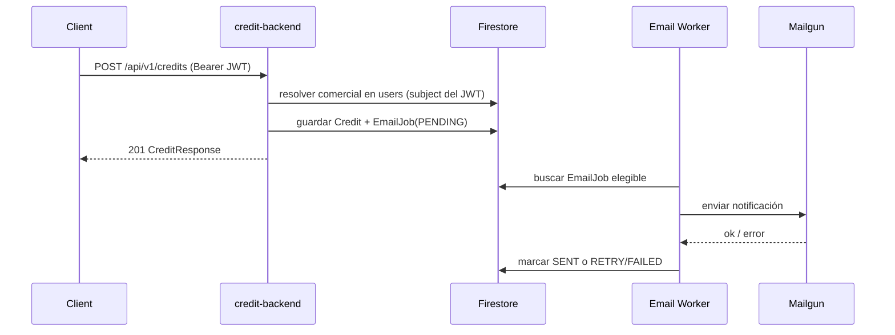
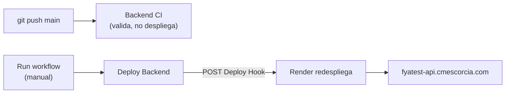

# Credit Backend

API en Spring Boot para la prueba técnica de créditos de Fya Social Capital — autenticación, registro/consulta de créditos y notificaciones por correo asíncronas.

## Demo En Vivo

No hace falta instalar nada para probar la API — ya está desplegada:

- **API**: `https://fyatest-api.cmescorcia.com`
- **Swagger UI**: **[https://fyatest-api.cmescorcia.com/swagger-ui/index.html](https://fyatest-api.cmescorcia.com/swagger-ui/index.html)** — probá los endpoints directo desde el navegador
- **Health check**: [https://fyatest-api.cmescorcia.com/actuator/health](https://fyatest-api.cmescorcia.com/actuator/health) — no es solo "¿está vivo el proceso?", incluye si Firestore realmente responde



Para autenticarte en Swagger: `POST /api/v1/auth/login` con una de las cédulas sembradas (`900100001` / `demo12345`, ver tabla en [Seed](#seed)), copiá el `token` de la respuesta, y pegalo en el botón **Authorize** (arriba a la derecha) como `Bearer <token>`.

Esta misma API es la que consumen `credit-web` ([demo en vivo](../credit-web/README.md#demo-en-vivo)) y `credit-mobile`. Para correr el backend en tu máquina en vez de usar la demo: [Instalación Local](#instalación-local).

## Sobre Esta Prueba Técnica

Este repo es uno de los tres entregables independientes de la prueba técnica de créditos:

| Repo | Rol | README |
|---|---|---|
| `credit-backend` (este repo) | API REST, persistencia en Firestore, seguridad JWT, rate limit, worker de correo | — |
| `credit-web` | Panel administrativo para registrar/consultar créditos y monitorear correos | [`../credit-web/README.md`](../credit-web/README.md) |
| `credit-mobile` | App Android para el comercial en campo | [`../credit-mobile/README.md`](../credit-mobile/README.md) |

Los tres consumen esta misma API — no hay lógica de negocio duplicada en los frontends.

## Arquitectura



### Login (con fallback demo)



### Registro de crédito → notificación por correo



## Stack

| Capa | Tecnología |
|---|---|
| Runtime | Java 21, Spring Boot 3.5.16 |
| Web | Spring Web, Validation, Security, Scheduling, Actuator |
| Datos | Firebase Admin SDK + Cloud Firestore |
| Auth | JWT (JJWT) |
| Rate limiting | Bucket4j |
| Correo | Mailgun REST API |
| Docs | springdoc OpenAPI |

## Instalación Local

Solo necesario si querés correr el backend en tu máquina en vez de usar la [demo en vivo](#demo-en-vivo).

### Requisitos Previos

- Java 21 y Maven 3.9+ (no hay wrapper `mvnw`), **o** Docker — `docker build` resuelve Maven/Java 21 dentro de la imagen sin instalar nada local.
- Un proyecto de Firebase con Firestore habilitado y un service account con permisos de lectura/escritura.
- Cuenta de Mailgun (opcional; el sandbox alcanza para probar el worker de correo).

### Paso A Paso

1. **Cloná el repo y entrá a la carpeta:**
   ```bash
   cd credit-backend
   ```
2. **Copiá el archivo de entorno y completalo:**
   ```bash
   cp .env.example .env
   ```
   Como mínimo necesitás `JWT_SECRET` (32+ caracteres) y las credenciales de Firebase. El camino más simple es pegar el JSON completo del service account en `FIREBASE_SERVICE_ACCOUNT_JSON` (una sola variable) en vez de llenar `FIREBASE_CLIENT_EMAIL`/`FIREBASE_PRIVATE_KEY` por separado.
3. **(Opcional) Sembrá datos de prueba** — ver [Seed](#seed). Sin esto, el login solo funciona con el usuario demo.
4. **Levantá el backend:**
   ```bash
   mvn spring-boot:run
   ```
   o, sin Maven local:
   ```bash
   docker build -t credit-backend:local .
   docker run -p 8080:8080 --env-file .env credit-backend:local
   ```
5. **Verificá que responde:**
   ```bash
   curl http://localhost:8080/actuator/health
   ```
   Documentación interactiva en `http://localhost:8080/swagger-ui/index.html`.
6. **Iniciá sesión** con un usuario sembrado (`900100001 / demo12345`) o con el usuario demo (`demo / demo12345`, activo cuando `DEMO_USER_PASSWORD_HASH` está vacío).

## API

Todas las rutas de `/api/v1/credits/**` y `/api/v1/email-jobs/**` requieren `Authorization: Bearer <token>`.

| Método | Ruta | Auth | Qué hace |
|---|---|---|---|
| POST | `/api/v1/auth/register` | Pública | Crea un usuario por cédula |
| POST | `/api/v1/auth/login` | Pública | Emite un JWT (cédula o usuario demo) |
| POST | `/api/v1/credits` | Bearer | Registra un crédito; encola `EmailJob(PENDING)` |
| GET | `/api/v1/credits` | Bearer | Lista créditos activos (filtros + orden) |
| GET | `/api/v1/credits/{id}` | Bearer | Obtiene un crédito activo |
| DELETE | `/api/v1/credits/{id}` | Bearer | Borrado lógico de un crédito |
| GET | `/api/v1/email-jobs` | Bearer | Lista trabajos de correo (filtros de estado/búsqueda) |
| GET | `/actuator/health` | Pública | Health check |
| GET | `/swagger-ui/index.html` | Pública | Documentación interactiva |

Formatos completos de request/response y códigos de error: [`docs/api.md`](docs/api.md).

## Firestore

| Colección | Qué guarda |
|---|---|
| `users` | Cuentas registradas; identidad para login y registro de créditos |
| `credits` | Créditos registrados (borrado lógico vía `isActive=false`) |
| `email_jobs` | Cola de notificaciones que procesa el worker programado |

Detalles e invariantes de campos: [`docs/firestore.md`](docs/firestore.md).

## Email Worker

`POST /credits` guarda un `EmailJob(PENDING)` y responde `201` sin esperar a Mailgun. Un worker programado (`EMAIL_WORKER_ENABLED=true`) toma los trabajos elegibles y los envía, con backoff cuadrático en los reintentos.

Variables de Mailgun requeridas: `MAILGUN_API_KEY`, `MAILGUN_DOMAIN`, `MAILGUN_BASE_URL`, `MAILGUN_FROM_EMAIL`, `MAILGUN_FROM_NAME`, `CREDIT_NOTIFICATION_EMAIL`. Detalle del flujo: [`docs/email-worker.md`](docs/email-worker.md).

## Seed

```bash
cd scripts/seed-firestore
npm install
npm run seed
```

Siembra los 10 créditos del anexo (cédulas de cliente `100000001..100000010`) y 3 perfiles comerciales:

| Cédula | Contraseña | Nombre |
|---|---|---|
| `900100001` | `demo12345` | Carlos Escorcia |
| `900100002` | `demo12345` | Jennifer Navarro |
| `900100003` | `demo12345` | Adriana Castellano |

## Test Y Build

```bash
mvn test
mvn package
```

```bash
docker build -t credit-backend:local .   # Maven + Java 21 dentro de la imagen
```

## Deploy

Producción corre en Render bajo el dominio propio `https://fyatest-api.cmescorcia.com`. El deploy es manual, igual que en `credit-web`.



Para desplegar: GitHub → **Actions** → **Deploy Backend** → **Run workflow**. Detalles (secrets, dominio/DNS, variables de Render): [`docs/deployment.md`](docs/deployment.md).

## Mapa De Documentación

| Archivo | Qué cubre |
|---|---|
| [`AGENTS.md`](AGENTS.md) | Reglas de trabajo para agentes en este repo |
| [`docs/api.md`](docs/api.md) | Contrato HTTP y códigos de error |
| [`docs/firestore.md`](docs/firestore.md) | Colecciones, campos, invariantes |
| [`docs/email-worker.md`](docs/email-worker.md) | Flujo de Mailgun y reintentos |
| [`docs/seed-firestore.md`](docs/seed-firestore.md) | Script de seed del anexo |
| [`docs/testing.md`](docs/testing.md) | Pruebas esperadas y limitaciones del entorno |
| [`docs/deployment.md`](docs/deployment.md) | Docker, Render, dominio, variables |
| [`docs/commit-guide.md`](docs/commit-guide.md) | Convenciones de commit |
| [`document/agents/`](document/agents/) | Playbooks de subagentes, contexto, templates |
