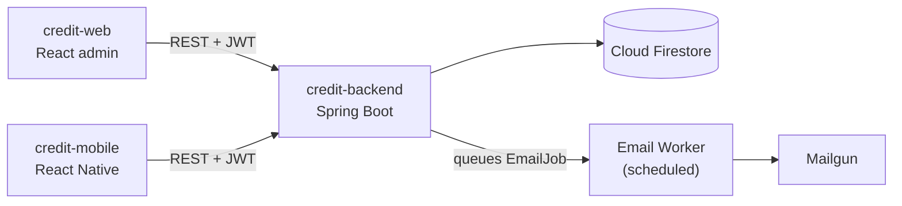
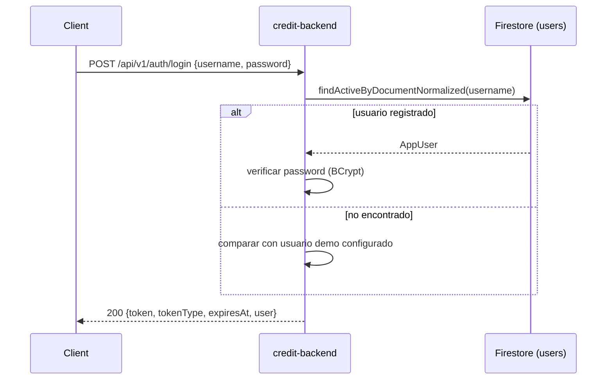
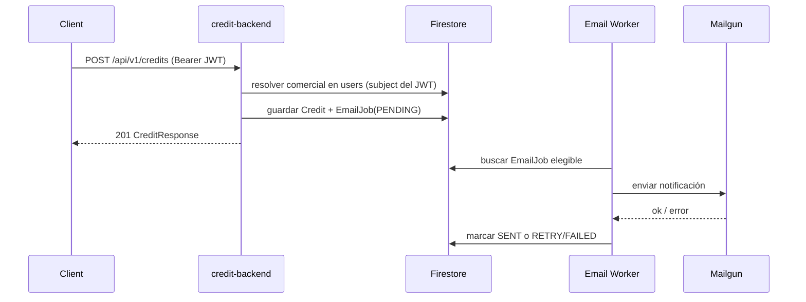

# Credit Backend

Spring Boot API for the Fya Social Capital credit technical test — auth, credit registration/query, and async email notifications.

## Sobre esta prueba técnica

Este repo es **uno de los tres entregables independientes** de la prueba técnica de créditos:

| Repo | Rol | README |
|---|---|---|
| `credit-backend` (este repo) | API REST, persistencia en Firestore, seguridad JWT, rate limit, worker de correo | — |
| `credit-web` | Panel administrativo (React) para registrar/consultar créditos y monitorear correos | [`../credit-web/README.md`](../credit-web/README.md) |
| `credit-mobile` | App Android (React Native) para el comercial en campo | [`../credit-mobile/README.md`](../credit-mobile/README.md) |

Los tres consumen esta misma API — no hay lógica de negocio duplicada en los frontends.

## Architecture



### Login (con fallback demo)



### Registro de crédito → notificación por correo



## Stack

| Layer | Tech |
|---|---|
| Runtime | Java 21, Spring Boot 3.5.16 |
| Web | Spring Web, Validation, Security, Scheduling, Actuator |
| Data | Firebase Admin SDK + Cloud Firestore |
| Auth | JWT (JJWT) |
| Rate limiting | Bucket4j |
| Email | Mailgun REST API |
| Docs | springdoc OpenAPI |

## Requisitos Previos

| Herramienta | Versión | Notas |
|---|---|---|
| Java | 21 | No hay wrapper `mvnw`; se necesita Maven instalado, o usar Docker (ver abajo) |
| Maven | 3.9+ | Solo si no usás Docker |
| Docker | opcional | `docker build` ya resuelve Maven/Java 21 dentro de la imagen |
| Proyecto Firebase | — | Con Firestore habilitado y un service account con permisos de lectura/escritura |
| Cuenta Mailgun | opcional | Sandbox alcanza para probar el worker de correo |

## Instalación Paso A Paso

1. **Cloná el repo y entrá a la carpeta:**
   ```bash
   cd credit-backend
   ```
2. **Copiá el archivo de entorno y completalo:**
   ```bash
   cp .env.example .env
   ```
   Como mínimo necesitás `JWT_SECRET` (32+ caracteres) y las credenciales de Firebase. El camino más simple es pegar el JSON completo del service account en `FIREBASE_SERVICE_ACCOUNT_JSON` (una sola variable) en vez de llenar `FIREBASE_CLIENT_EMAIL`/`FIREBASE_PRIVATE_KEY` por separado.
3. **(Opcional) Sembrá datos de prueba** — ver [Seed](#seed) más abajo. Sin esto, el login solo funciona con el usuario demo.
4. **Levantá el backend:**
   ```bash
   mvn spring-boot:run
   ```
   o, sin Maven local:
   ```bash
   docker build -t credit-backend:local .
   docker run -p 8080:8080 --env-file .env credit-backend:local
   ```
5. **Verificá que responde:**
   ```bash
   curl http://localhost:8080/actuator/health
   ```
   Documentación interactiva en `http://localhost:8080/swagger-ui/index.html`.
6. **Iniciá sesión** con un usuario sembrado (`900100001 / demo12345`) o con el usuario demo (`demo / demo12345`, activo cuando `DEMO_USER_PASSWORD_HASH` está vacío).

Registered users log in with their cédula (`document`) and password.

## API

All `/api/v1/credits/**` and `/api/v1/email-jobs/**` routes require `Authorization: Bearer <token>`.

| Method | Path | Auth | Purpose |
|---|---|---|---|
| POST | `/api/v1/auth/register` | Public | Create a user by cédula |
| POST | `/api/v1/auth/login` | Public | Issue a JWT (cédula or demo user) |
| POST | `/api/v1/credits` | Bearer | Register a credit; queues `EmailJob(PENDING)` |
| GET | `/api/v1/credits` | Bearer | List active credits (filters + sort) |
| GET | `/api/v1/credits/{id}` | Bearer | Get one active credit |
| DELETE | `/api/v1/credits/{id}` | Bearer | Soft-delete a credit |
| GET | `/api/v1/email-jobs` | Bearer | List notification jobs (status/search filters) |
| GET | `/actuator/health` | Public | Health check |
| GET | `/swagger-ui/index.html` | Public | Interactive API docs |

Full request/response shapes and error codes: [`docs/api.md`](docs/api.md).

## Firestore

| Collection | Purpose |
|---|---|
| `users` | Registered accounts; login and credit-registration identity |
| `credits` | Registered credits (soft-deleted via `isActive=false`) |
| `email_jobs` | Notification queue processed by the scheduled worker |

Details and field invariants: [`docs/firestore.md`](docs/firestore.md).

## Email Worker

`POST /credits` stores an `EmailJob(PENDING)` and returns `201` without waiting for Mailgun. A scheduled worker (`EMAIL_WORKER_ENABLED=true`) picks up eligible jobs and sends them, with quadratic backoff on retry.

Required Mailgun variables:

| Variable | Purpose |
|---|---|
| `MAILGUN_API_KEY` | Mailgun API key |
| `MAILGUN_DOMAIN` | Sending domain |
| `MAILGUN_BASE_URL` | API base URL |
| `MAILGUN_FROM_EMAIL` | Sender address |
| `MAILGUN_FROM_NAME` | Sender display name |
| `CREDIT_NOTIFICATION_EMAIL` | Recipient for credit-registered notifications |

Flow details: [`docs/email-worker.md`](docs/email-worker.md).

## Seed

```bash
cd scripts/seed-firestore
npm install
npm run seed
```

Seeds the 10 annex credits (numeric client documents `100000001..100000010`) and 3 commercial login profiles:

| Document | Password | Name |
|---|---|---|
| `900100001` | `demo12345` | Carlos Escorcia |
| `900100002` | `demo12345` | Jennifer Navarro |
| `900100003` | `demo12345` | Adriana Castellano |

## Test & Build

```bash
mvn test
mvn package
```

```bash
docker build -t credit-backend:local .   # Maven + Java 21 inside the image
```

## Deploy

Render should provide environment variables from `.env.example`. The free tier may sleep; pending email jobs stay persisted in Firestore and are picked up after restart. Details: [`docs/deployment.md`](docs/deployment.md).

## Documentation Map

| File | Covers |
|---|---|
| [`AGENTS.md`](AGENTS.md) | Working rules for agents in this repo |
| [`docs/api.md`](docs/api.md) | HTTP contract and error codes |
| [`docs/firestore.md`](docs/firestore.md) | Collections, fields, invariants |
| [`docs/email-worker.md`](docs/email-worker.md) | Mailgun flow and retries |
| [`docs/seed-firestore.md`](docs/seed-firestore.md) | Annex seed script |
| [`docs/testing.md`](docs/testing.md) | Expected tests and environment gaps |
| [`docs/deployment.md`](docs/deployment.md) | Docker, Render, env vars |
| [`docs/commit-guide.md`](docs/commit-guide.md) | Commit conventions |
| [`document/agents/`](document/agents/) | Subagent playbooks, context, skill templates |
