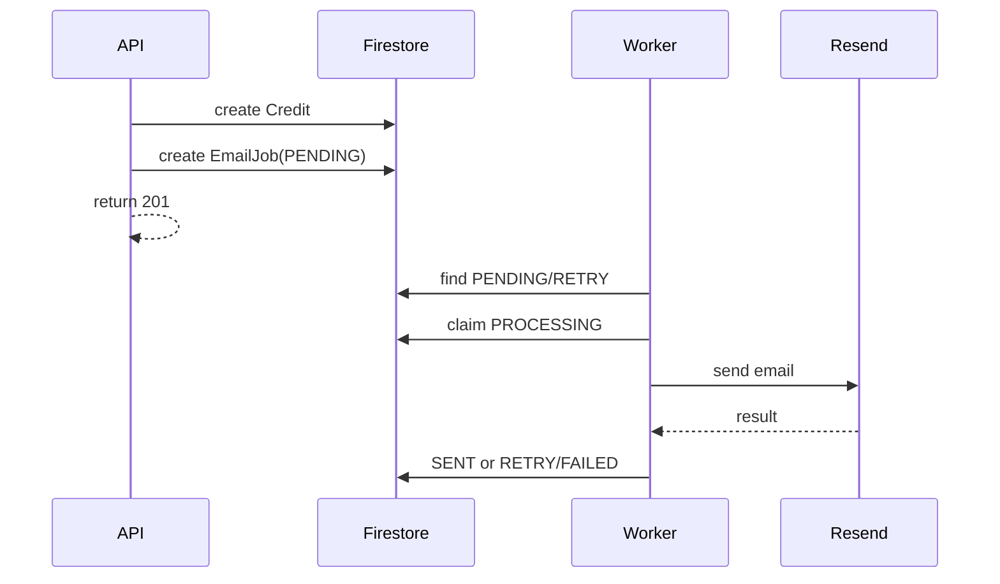

# Email Worker

## Proposito
Enviar por Resend la notificacion de credito registrado sin bloquear `POST /credits`.

## Flujo

## Configuracion
- `EMAIL_WORKER_ENABLED`
- `EMAIL_WORKER_FIXED_DELAY_MS`
- `EMAIL_WORKER_BATCH_SIZE`
- `EMAIL_WORKER_MAX_ATTEMPTS`
- `RESEND_API_KEY`
- `RESEND_BASE_URL`
- `RESEND_FROM_EMAIL`
- `RESEND_FROM_NAME`
- `CREDIT_NOTIFICATION_EMAIL`
- `APP_FRONTEND_BASE_URL`: base del panel para el botón "Ver detalle completo" del correo (el logo del correo usa una URL de producción fija, no esta variable).

En produccion, `RESEND_FROM_EMAIL` debe pertenecer a un dominio verificado en Resend. Si se usa un remitente de prueba o un dominio no verificado, Resend puede responder `403` y el job pasara a `RETRY`/`FAILED` segun los intentos configurados.

## Reglas
- El worker solo procesa `PENDING` y `RETRY` elegibles por `nextAttemptAt`.
- `claimProcessing` evita reprocesar trabajos tomados por otro proceso.
- Errores se sanitizan antes de persistirse en `lastError`.
- El backoff crece cuadraticamente y se limita a 30 minutos.
