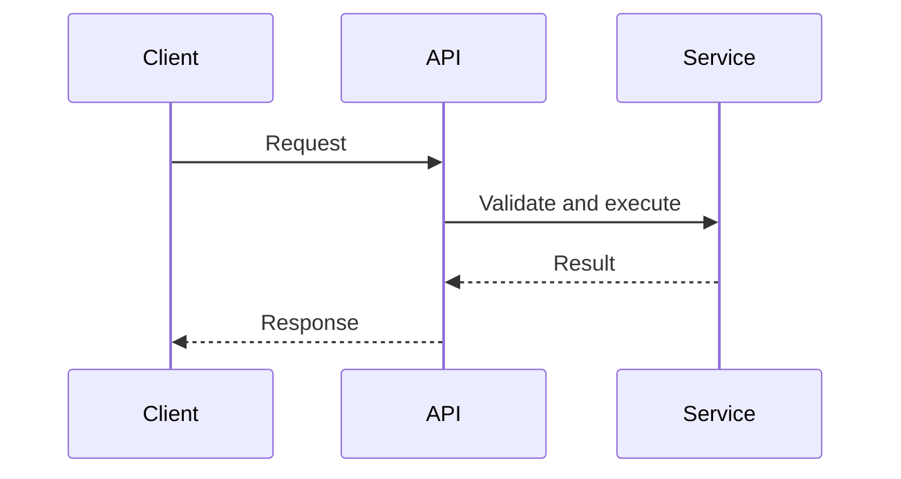

# Endpoint: <Nombre>

## Metodo Y Ruta
- `<METHOD> /api/v1/...`

## Auth
- Publico o `Authorization: Bearer <token>`.

## Variables De Entorno
- `<VAR>`: <uso>

## Request
```json
{}
```

## Response
```json
{}
```

## Errores
- `400 VALIDATION_ERROR`
- `401 UNAUTHORIZED`
- `404 NOT_FOUND`
- `429 TOO_MANY_REQUESTS`
- `503 DEPENDENCY_UNAVAILABLE`

## Flujo


## Notas Operativas
- <Invariantes, limites y riesgos>

